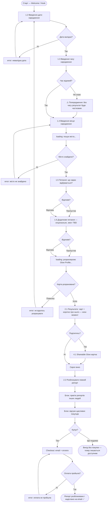
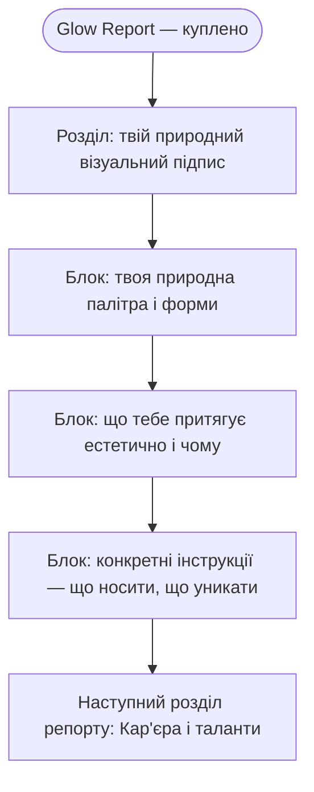
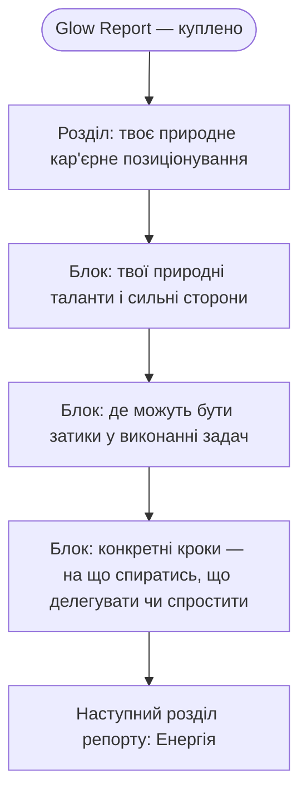

# Flows — Astro Recipe
# Ніша: Glow — жити в своїй природі, а не проти неї

> Дата: 2026-07-08 · оновлено 2026-07-17
> Формат: Mermaid flowchart. Кожен вузол звірений з sitemap.md.
> Планети не вказані — астрологічна інтерпретація TBD.
> **Оновлення 2026-07-17 (ранок):** 2.3 Рутина → Кар'єра і таланти (R2), 2.5 Присутність → Соушал медіа контент (R4). Flow 3 нижче переписано під нову R2.
> **Оновлення 2026-07-17 (день):** новий core flow — тизер-сторінка з чартом → скрол → repotу CTA з прев'ю чужих репортів і відгуками → checkout (email + оплата) → репорт розблоковано. Flow 1 нижче оновлено. **Вирішено:** Flow 2 і Flow 3 (стиль, кар'єра — нижче) — це вміст купленого Glow Report, не окремі екрани сайту. Flow 2/3 нижче оновлено 2026-07-19 (раніше тут висіло відкрите питання — пропущено при синхронізації з ia.html, виправлено).

---

## Flow 1 — Main Job
**"Отримати Glow Profile — зрозуміти свою природну мову через карту"**
Primary persona: Маша. Entry: перший запуск.

---

## Flow 2 — R1: Стиль і естетика (розділ Glow Report)
**"Знайти свою справжню візуальну мову"**
Entry: розділ купленого Glow Report, одразу після checkout. Це вміст репорту, не окремий екран сайту (рішення 17.07, день).

---

## Flow 3 — R2: Кар'єра і таланти (розділ Glow Report)
**"Зрозуміти кар'єрне позиціонування, свої таланти і де можуть бути затики у виконанні задач"**
Entry: розділ купленого Glow Report, одразу після розділу Стиль. Це вміст репорту, не окремий екран сайту (рішення 17.07, день).

---

## Нотатки

**Стани у кожному flow:**
- `loading` — розрахунок карти, пошук міста
- `error` — невалідна дата, місто не знайдено, помилка розрахунку, **оплата не пройшла (нове 17.07)**
- `empty` — карта відсутня → redirect на онбординг
- `success` — репорт розблоковано і надіслано на email (нове 17.07, замінює "Glow Profile збережено")

**Тупики знайдено і виправлено:**
- Час невідомий → попередження + продовжуємо, не блокуємо
- Місто не знайдено → той самий крок, не скидаємо попередні дані
- Питання "що зараз?" і додаткове питання (1.6) пропущені → продовжуємо без відповіді
- Помилка розрахунку → повернення до введення дати з повідомленням
- Оплата не пройшла (нове 17.07) → назад на checkout, дані форми не скидаються
- Не купує на кроці розблокування (нове 17.07) → вихід без покупки, тизер-сторінка лишається доступною (не глухий кут)
