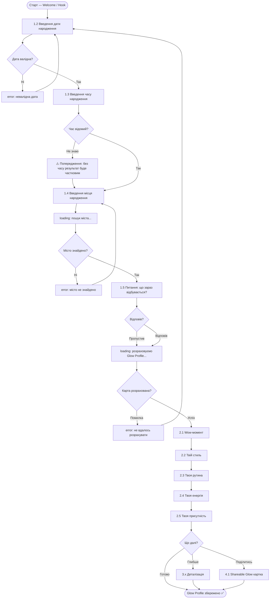
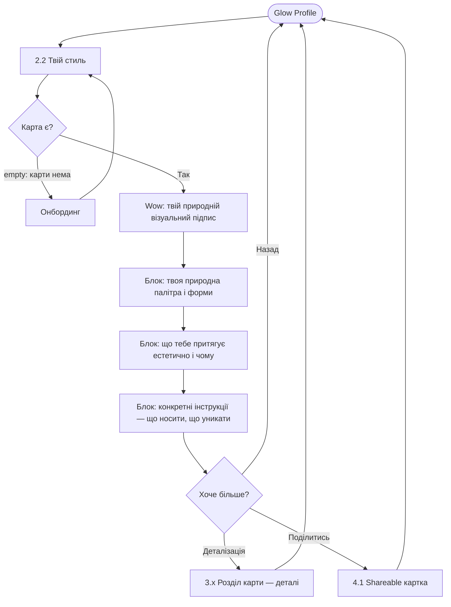
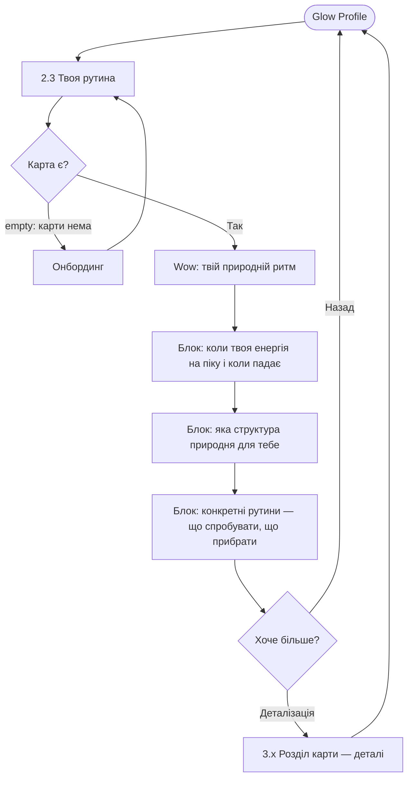

# Flows — Astro Recipe
# Ніша: Glow — жити в своїй природі, а не проти неї

> Дата: 2026-07-08
> Формат: Mermaid flowchart. Кожен вузол звірений з sitemap.md.
> Планети не вказані — астрологічна інтерпретація TBD.

---

## Flow 1 — Main Job
**"Отримати Glow Profile — зрозуміти свою природну мову через карту"**
Primary persona: Маша. Entry: перший запуск.

---

## Flow 2 — R1: Стиль і естетика
**"Знайти свою справжню візуальну мову"**
Entry: секція "Твій стиль" в Glow Profile.

---

## Flow 3 — R2: Рутина
**"Побудувати рутину що приживається"**
Entry: секція "Твоя рутина" в Glow Profile.

---

## Нотатки

**Стани у кожному flow:**
- `loading` — розрахунок карти, пошук міста
- `error` — невалідна дата, місто не знайдено, помилка розрахунку
- `empty` — карта відсутня → redirect на онбординг
- `success` — Glow Profile отримано

**Тупики знайдено і виправлено:**
- Час невідомий → попередження + продовжуємо, не блокуємо
- Місто не знайдено → той самий крок, не скидаємо попередні дані
- Питання "що зараз?" пропущено → продовжуємо без відповіді
- Помилка розрахунку → повернення до введення дати з повідомленням
