# Mobbin Visual-Style Research — Astro Recipe

> **Method:** Mobbin MCP (official server, iOS library, deep search mode). Every screen cited was visually inspected — colors are eyeballed hex approximations, not extracted tokens.
> **Focus:** visual style — palette, typography, density/rhythm, mood — to feed the concept + design-system phase (Урок 6–7). Companion to `concept/references.md`.
> **Date:** 2026-07-20.
> **Supersedes:** the earlier Playwright/Mobbin scrape (artifact "Astro Recipy — патерни з Mobbin"), which was UX-pattern-focused. This one is visual-style-focused and grounded in inspected screens with citable links.

---

## Honesty note — what Mobbin actually indexes

Several named competitors are **not in Mobbin's iOS library** (confirmed by repeated targeted searches):

- **Not found on Mobbin:** Nebula, The Pattern, Sanctuary, CHANI.
- **Found on Mobbin (deep):** Co–Star, Moonly, Calm, Fabulous, Wysa, Dimensional, Tolan; plus premium-paywall exemplars (komoot, Tiimo, TIDE) and genre one-offs (Google Arts & Culture tarot, Tinder Astrology, Snapchat astrology).
- **CHANI — profiled from a real device screen-recording** (`Videos/ScreenRecording_06-25-2026 22-17-10_1.MP4`, ~7 min full walkthrough), not a stand-in. See the dedicated section below — this is our stated benchmark, so it's first-class evidence. Screenshots saved to `research/screens/chani/`.
- Two further recordings in `Videos/` are **AstroBella** (a purple-cosmic astrology app) — a real example of the "avoid" pole; not yet fully profiled (offer stands to analyze on request).

Where a target was still missing (Nebula, The Pattern, Sanctuary), the closest real aesthetic neighbor is profiled and **clearly labeled as a stand-in**.

---

## TL;DR — the visual decisions this research points to

The category has **two overused looks**, and the opportunity is the unclaimed middle:

| Pole | Who | Signal | Verdict for us |
|---|---|---|---|
| Cold editorial grayscale | Co–Star, Dimensional | serious, intellectual, print-like | steal the *structure*, reject the *coldness* |
| Fiolet cosmic gradient | Moonly, Nebula, Tinder Astrology | mystical, consumer, gamified | **avoid** — this is the templated trap |
| Warm credible wellbeing | Calm, Fabulous, Tolan | human, trustworthy, gift-like | **closest to our target** |

**Astro Recipe's lane: warm editorial.** Human and concrete without the purple-cosmic cliché and without Co-Star's clinical chill. Concretely:

1. **Type does the heavy lifting.** Expressive high-contrast **serif** for display (the wow-moment line, section titles) + **monospace / letter-spaced uppercase** for micro-labels and eyebrows. This is the single fastest way to read "personal astrology, considered" instead of "SaaS template." Proven by Co–Star, Moonly, and Tolan independently. → matches `references.md` #1 (CHANI type pairing).
2. **Warm paper ground + one reserved accent.** Ivory/sand `#F5F1E8`–`#FAFAF8`, near-black ink, and **one warm accent** (terracotta/amber, or the blush/lavender from `references.md`) used *only* for CTA, the selected paywall tier, and small emblems. Never dark cosmic gradients + neon. → matches `references.md` #2 (Glow warm neutrals + one accent).
3. **The paid report is a document, not a fifth screen.** A repeated eyebrow taxonomy per Glow dimension + hairline dividers + a "Based on your ☉ [placement]" byline under every guidance block. This is the biggest lever for making it feel like a $50 keepsake. → matches `references.md` #3 (astrologer-report document) and enacts `voice.md` ("advice tied to *this* person's chart").
4. **Chart wheel as line-art engraving, not a 3D toy.** Thin ink lines on paper (Co–Star), not glossy colored orbs (Moonly). Steal Co-Star's italic-labeled aspect arcs to visualize one placement at a time — literally drawing the "reads the chart in combination" differentiator.
5. **Warmth lives in the picture layer, not the chrome.** Every app that escapes cold-SaaS does it through imagery (Calm's photography, Fabulous's sunrise, Wysa's doodles) while keeping buttons/structure quiet. Invest personality in one hero image/illustration per section. → aligns with `references.md` #4 (ambient Glow) but keep it restrained.
6. **Stage the teaser as a reveal beat.** Moon-phase strips, "reading your cards…" pauses, card flips, big-number reveals — the category turns results into anticipation. The free chart teaser (the wow moment) should be a staged moment, not an instant data dump.

---

## ★ CHANI — real device walkthrough (the benchmark)

> Source: full 7-minute screen recording, iPhone, entire flow signup → chart → paid content → account. Screenshots in `research/screens/chani/`. This is `references.md` #1 made concrete — and CHANI turns out to be **warmer and more playful** than its "restrained editorial" reputation suggested.

**Positioning:** hand-crafted zine mysticism — a warm off-white almanac with a distressed hand-stamped logo, surreal black-&-white photo-collage, and a three-voice type system. Editorial like Co–Star, but **warm, witty and handmade** where Co–Star is cold. Literally labels a horoscope window "CHAOTIC GOOD."

**Palette**
- Ground: warm bone / off-white `#F1EFEA`–`#F3F1EC` (never pure white).
- Ink: near-black `#141414`.
- **Signature accent: hot magenta `#E0189A`** — active nav icon, and a soft pink halo glow under black CTA pills.
- Functional green `#1FA85C` for helper links ("RESEND CONFIRMATION CODE", "EMAIL INFO@CHANI.COM") and a mint "ANNUAL OFFER / SAVE 25%" pill.
- Gold `#C9A227` for the "key" illustration and star sparkles.
- CTAs: **black pill `#111` + white text + pink glow.**
- So: warm neutral base + **one bold accent (magenta)** + small functional green/gold. Colorful but disciplined — and crucially **not purple-cosmic.**

**Typography — a three-voice system** (warmer than Co–Star's two)
- **Display:** expressive high-contrast **serif italic** (Didone/fashion-serif feel) for every section title — *Your birth chart*, *Transits*, *Scorpio rising*, *Verification station*. Personal, editorial.
- **Logo:** distressed hand-stamped "CHANI" + script "universe."
- **Body:** friendly humanist **sans-serif**, generous line-height, for all reading passages — comfortable long-form.
- **Micro-labels / data / chrome:** **monospace uppercase, letter-spaced** — `MONTH DAY YEAR`, `URANUS SQUARE ASCENDANT`, `MAKE IT MAKE SENSE`, `GO DEEPER WITH PREMIUM`, nav labels, account menu.
- Takeaway: **expressive serif display + humanist sans body + monospace labels.** This is exactly `references.md` #1, and the added warm sans body is what makes it more readable/human than Co–Star's serif-everything.

**Density & rhythm:** generous, one idea per screen, centered serif titles each underlined by a **hand-drawn wavy squiggle divider** (a signature). Reading screens are calm single-column sans. Onboarding uses labeled dashed-border input fields.

**Signature visual devices**
- **Hand-drawn distressed logo + squiggle/wave dividers** under headings — everywhere; the core warmth signal.
- **Surreal B&W photo-collage with spot objects** — dogs+rabbit in party hats under a rainbow; frog on a book with a rainbow halo; gold pocket-watch + hedgehogs (Transits); goat on a skateboard with a pink hula-hoop (Grow); toucan-with-fairy-wings + a nest egg (onboarding); cats with a heart (keys); orange phone-booth with monkeys (Listen); cat-on-a-burger (account). Dada/ransom-note zine energy — this IS the personality.
- **👁 eye glyph appended to CTAs** ("COME ON IN 👁", "MAKE IT MAKE SENSE 👁") + playful microcopy.
- Natal chart: classic **thin-line circular zodiac wheel**, black on bone, sign names round the ring — editorial-astronomical, not a 3D toy. A **gold key** marks "The keys to your chart."
- Hand-drawn bottom-nav icons (house / crystal-ball / spoke-wheel / alarm-clock / headphones), active in magenta.

**Mood:** warm, witty, handmade, a little chaotic-good — mystical without being self-serious. A collaged zine from a clever friend, not a clinical data app. **This is the exact register Astro Recipe is aiming for.**

**Screens (saved locally)**

| Onboarding & chart | | | |
|---|---|---|---|
| 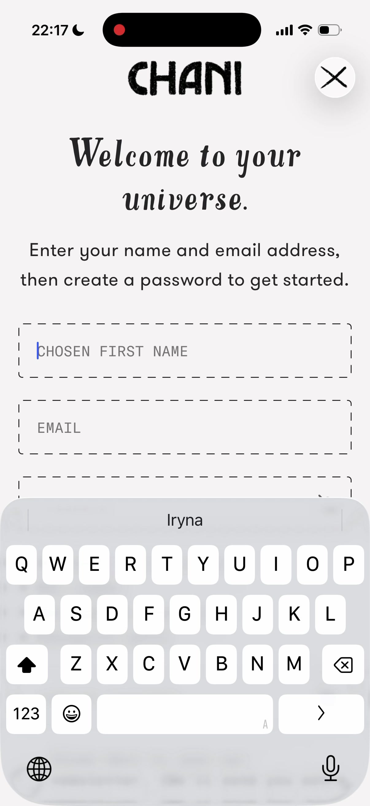 | 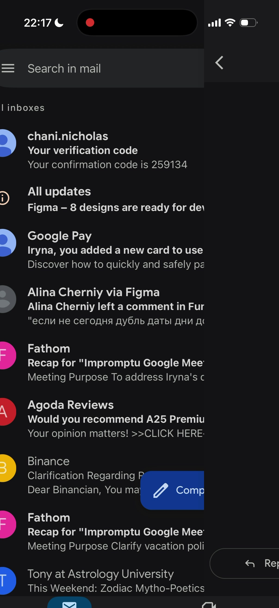 | 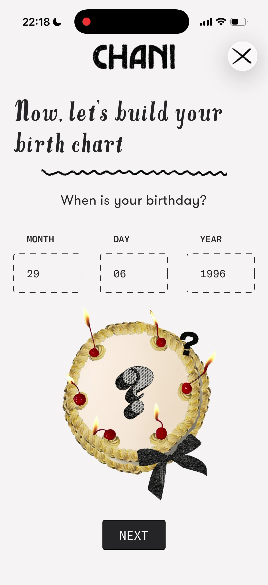 | 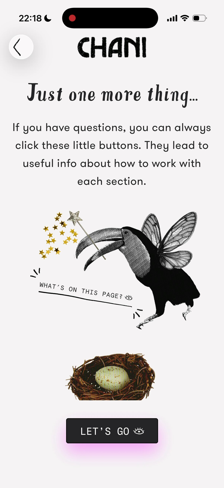 |
| signup — hand-stamped logo, dashed inputs, "COME ON IN 👁" | "Verification station" — party-hat animal collage | "build your birth chart" — labeled MONTH/DAY/YEAR | "Just one more thing…" toucan-fairy + nest collage |
| 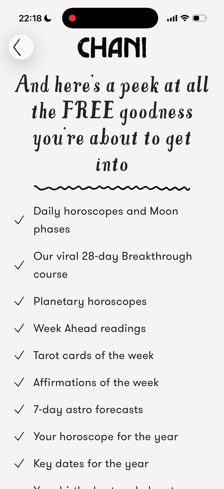 | 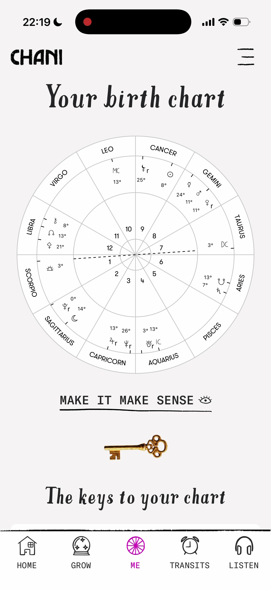 | 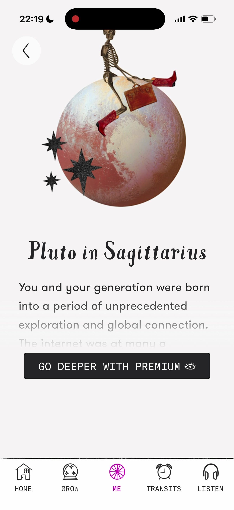 | 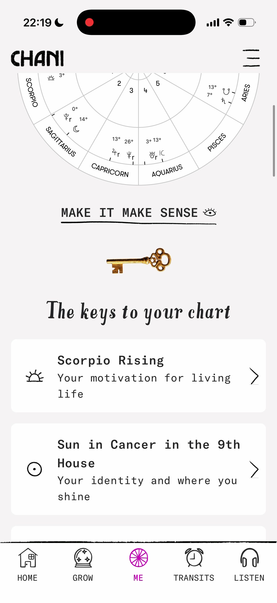 |
| free-tier value checklist + squiggle divider | **birth chart wheel** — thin line, bone ground | paywall — mint "ANNUAL OFFER" pill, annual/monthly | Planets list — glyph + monospace subtitle cards |

| Content & paid | | | |
|---|---|---|---|
| 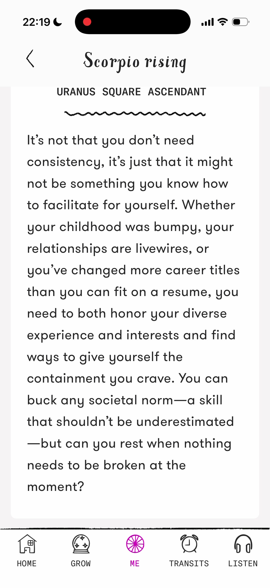 | 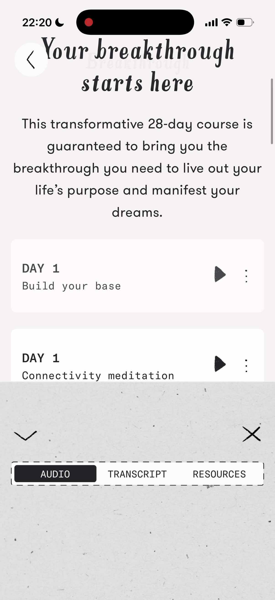 |  | 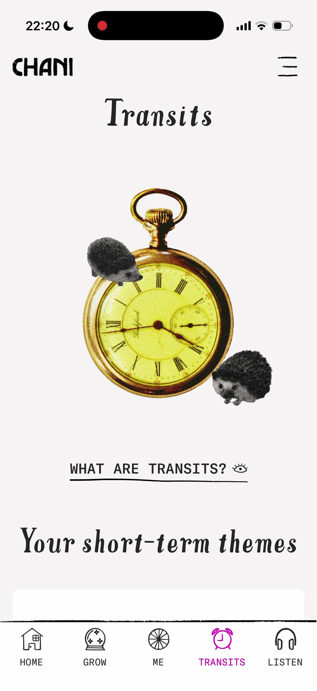 |
| "Scorpio rising" — monospace aspect eyebrow → squiggle → sans body | CHANI Courses audio player (AUDIO/TRANSCRIPT/RESOURCES) | "Grow" — goat-on-skateboard collage, "7 LESSONS" | "Transits" — gold pocket-watch + hedgehogs |
| 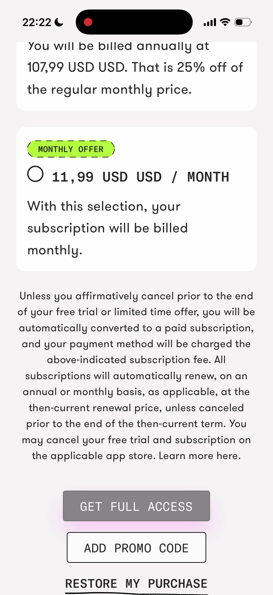 | 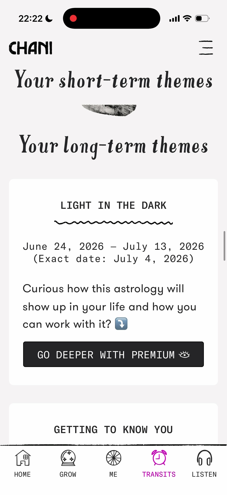 | 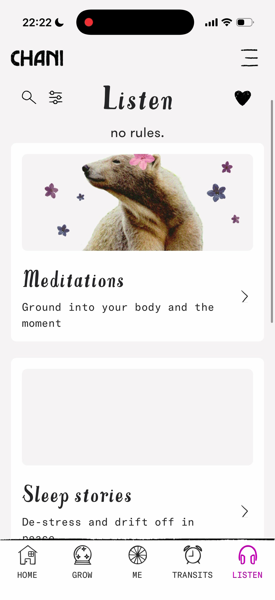 | 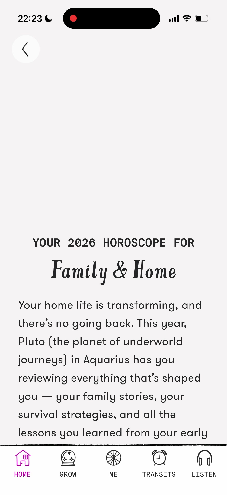 |
| premium gate — benefits checklist | "Your long-term themes" — dated ranges, "GO DEEPER" | "Listen" — phone-booth collage, Affirmations | "Your 2026 horoscope for Family & Home" long-form |

**Borrow for Astro Recipe (this is the primary reference — strong takeaways)**
1. **Adopt CHANI's three-voice type system** — expressive serif display + warm humanist sans body + monospace uppercase labels. Warmer and more readable than Co–Star's serif+mono; confirms `references.md` #1 with real evidence.
2. **Squiggle / hand-drawn wave divider under section titles** — cheap, ownable "handmade, not templated" signal. Easy to reproduce in CSS/SVG.
3. **Warm off-white + ONE bold accent, no purple.** CHANI proves you can be warm-editorial with a lively accent (magenta) and stay clear of the cosmic-purple cliché. Decision to make: keep magenta's energy (fits the content-creator audience) or soften to the blush/lavender in `references.md` — but commit to **one** accent, not CHANI's magenta+green+gold at once.
4. **Reading/report block grammar:** monospace uppercase eyebrow (e.g. `URANUS SQUARE ASCENDANT`) → squiggle divider → sans body. This is the Tolan block-grammar but warmer — a ready template for our per-placement report blocks and the four Glow dimensions.
5. **Collage as the personality layer.** One surreal spot-color collage per section carries all the mood while chrome stays quiet (matches the "warmth lives in the picture layer" finding) — but an *illustration/collage* route, distinct from Calm's photography. Ownable.
6. **Voice-forward CTAs + a small motif** ("COME ON IN", "MAKE IT MAKE SENSE 👁", "CHAOTIC GOOD"). Ties straight to `voice.md`; a tiny recurring glyph on buttons adds character cheaply.
7. **Free-tier value checklist** ("all the FREE goodness you're about to get") — a strong teaser→paywall bridge pattern for our step-4→5 transition.

**Caveats / what to dose down:** CHANI's paywall fine-print is heavy, and magenta+mint-green+gold+collage all at once tips toward cluttered. Take the *structure and warmth*, keep our color to one accent and our collage lighter.

---

## Cluster 1 — Astrology-core

### Co–Star — FOUND (deep)
**Positioning:** Brutalist literary minimalism — a printed poetry chapbook that happens to be an app.

- **Palette:** near-white paper `#F4F3F1`/`#FFFFFF` (matching near-black dark mode `#0C0C0C`); ink `#111111`; essentially **zero chroma** — the only color is an occasional muted brick-red marker `#B0402E`. Accent is the *absence* of accent.
- **Typography:** high-contrast transitional/Didone **serif** for the big daily aphorism (the whole personality); **monospace**, all-caps, letter-spaced for labels (`CHART`, `TRANSITS`, `DO / DON'T`); plain sans for long body. The serif + mono pairing is the signature.
- **Density:** extreme whitespace, one idea per screen, centered columns, hairline rules. Anti-grid, unhurried.
- **Devices:** natal chart as thin concentric orbital rings around a small grayscale Earth with hand-drawn aspect arcs ("Conjunction", "Sextile"); alternate chart as a plain bordered **table**; grainy B&W photo-collage cutouts (beetle, statue) in white space; Do/Don't two-column serif lists.
- **Mood:** cool, cerebral, dry, slightly ominous — a fortune on matte stock. Intellectual, not warm.
- **Screens:** [daily aphorism + Do/Don't](https://mobbin.com/screens/346049ea-9e2c-4e96-965e-358ce5d38f60) · [orbital-ring chart with aspect arcs](https://mobbin.com/screens/63f46127-c56f-4dce-a3fa-b98256776dea) · [chart-as-table](https://mobbin.com/screens/8a31151a-1dab-463e-85fb-f929c5f36854) · [long-form reading with placement byline](https://mobbin.com/screens/95c7db6c-ff22-4949-bd3b-ffda48a8b68b)
- **Borrow:** serif-headline + monospace-label pairing; the **Do/Don't two-column list** (maps directly to our "concrete guidance, not character description"); the **"Based on your [placement]" byline**. But swap the clinical grayscale for warmth.

### Nebula — NOT ON MOBBIN → stand-in: Moonly
Cosmic purple, glossy, mass-market. Stand-in Moonly: saturated violet `#6C4CE0`–`#7B52E8`, dark starfield cards `#12121F`, gold accents `#E8A33D`, candy-colored 3D planet renders; big friendly rounded sans + oversized italic-serif "You". Dreamy, premium-consumer, gamified. [Moonly 3D birth-chart card](https://mobbin.com/screens/0cd08d0d-eaba-4d0f-afd8-109fd75868ed). **This is the look to avoid** — the generic purple-cosmic default.

### The Pattern — NOT ON MOBBIN → stand-in: Dimensional
Dark psychological-depth lane. Dimensional: true dark `#0A0A0A`, off-white text `#EDEDED`, one electric cyan `#3FA9F5` + a warm terracotta `#C6754A` per-trait accent; clean plain sans; **labeled spectrum sliders** between opposed traits, "Data Stories" comparison cards, muted painterly archetype art. Introspective, therapy-adjacent. [trait spectrum sliders](https://mobbin.com/screens/0ac4eb99-af51-4abb-b804-b37b32cc0ebc) · [archetype summary](https://mobbin.com/screens/e84472a8-15d4-4b21-9026-6a79fccbeecb). **Borrow:** dark + one warm accent is a disciplined system; the trait-spectrum slider is a good "where you sit" visualization.

### Sanctuary — NOT ON MOBBIN → stand-in: Moonly "Luna" chat
Live-astrologer chat lane. Soft lavender/white chat, purple bubbles `#7B61E8`, rounded humanist sans, astrologer avatar + "YOUR PERSONAL ASTROLOGER" label. Intimate, cozy, conversational. [Moonly "Luna" chat](https://mobbin.com/screens/6b83cdee-c6e4-4438-9dcc-60a169afd97e).

**Cluster summary:** two poles — cold editorial grayscale (Co–Star) vs warm cosmic color (Moonly/Nebula camp), with Dimensional in a quiet dark-minimal-one-accent third lane. **Chart rendering is the identity signal** (austere line diagram = "serious astrologer"; glossy 3D orb = "mystical consumer"). Purple+starfield is the category default; grayscale signals premium/intellectual. Our unclaimed middle: **warm and human without the purple.**

---

## Cluster 2 — Esoteric + Wellbeing

### Moonly — FOUND — astrology + tarot + rituals
**Positioning:** premium mystical "night sky" — deep indigo cosmos, hand-painted celestial illustration, elegant serif voice.
- **Palette (dark-first):** `#0C0B14`/`#14132A` starfield; brand purple `#6B4CE6`→`#7A5CF0`; night-blues `#1E2A5A`→`#2B3F7A`; warm gold `#E5B25D` + painterly peach `#E7A38C` from imagery; white text `#F5F5FA`, muted `#8A8AA0`.
- **Typography:** high-contrast **serif** display (Didot/Playfair feel) + quiet sans body + tracked small-caps micro-labels. The expressive-serif/quiet-sans split is the transferable move.
- **Devices:** claymation-style 3D objects; painterly goddess-with-crescent-crown motif; persistent moon-phase strip; gradient-illustrated tarot cards; celestial-glyph tab bar.
- **Mood:** enchanted, feminine, premium-spiritual, aspirational.
- **Screens:** [home — serif "Waxing Moon" + 3D chart card](https://mobbin.com/screens/0f4d52ed-9f8d-4b98-b286-09bbd7106cd4) · [onboarding "Future Self"](https://mobbin.com/screens/f722dc8f-7ef1-4c7b-a107-ffe311b196dc) · [floating Glow-dimension pills (Romance/Money-Career/Self-care)](https://mobbin.com/screens/f9eb51dc-f9ce-4d73-8e55-085ff8a1657c)
- **Borrow:** the serif-headline/sans-body pairing; **floating pill-labels around a central figure** to preview our four Glow dimensions (near-identical to our product structure). But take the type, drop the dark cosmos.

### Calm — FOUND — meditation
**Positioning:** serene photographic nature — full-bleed landscapes, the calmest possible UI.
- **Palette:** hero **photography** blending into Calm blue `#3A6EA5`→`#5B8BB8`; theme variants follow the photo (a green foliage version exists); white text over dark scrims; player screens shift to warm sunset `#C97B5A` or night navy `#0D1B3E` per content mood.
- **Typography:** handwritten "Calm" script logo; clean humanist sans everywhere else — imagery carries personality, not type.
- **Density:** very low. Huge hero, one greeting line, horizontal content shelves; near-empty player. **Whitespace is the product.**
- **Devices:** photographic landscapes as the whole canvas; frosted-glass controls; segmented weekly-streak ring; soft gradient scrims, no hard edges.
- **Screens:** [home — mountain-lake + "Good Afternoon"](https://mobbin.com/screens/233d2d54-7e43-44fc-a139-4cf1cb47eb43) · [streak-ring variant](https://mobbin.com/screens/82e555db-347c-4690-95fe-fb1d395b9c7e) · [sunset player](https://mobbin.com/screens/f7bafdf8-009c-4d58-a50a-c90812ce1f89)
- **Borrow:** **one atmospheric hero image sets the palette per section** (each Glow dimension its own tonal photo) with UI chrome near-invisible; photography + whitespace + one warm line = antidote to cold-SaaS.

### Fabulous — FOUND — science-framed habits
**Positioning:** optimistic "sunrise" gamified coaching — bold flat illustration, warm gradients, confident plain sans.
- **Palette:** sunrise/sunset gradients magenta→red→orange `#8E2DE2`→`#E63946`→`#F7A440` with teal mountain silhouettes; blue→purple hero cards; magenta CTA `#E6316E`/`#FF4D8D`; clean white `#FFFFFF` utility/checklist mode; yellow `#F5B301` encouragement, green check `#3FB950`.
- **Typography:** sturdy geometric/humanist **sans, bold** for declarative headings; copy-heavy "letter from your future self" paragraphs. No serif.
- **Devices:** low-poly/papercraft "future self" figures; journey/path + sun-on-horizon hope motif; **authority/science badges** (Duke, Editor's Choice) as trust cues.
- **Mood:** warm, encouraging, self-improvement-optimistic. "Science" is verbal/badge-based, not a cold visual system.
- **Screens:** [onboarding "Why are you embarking…" choice cards](https://mobbin.com/screens/980c7041-c50d-4862-89a7-c74d61f724b4) · [sunrise gradient "One last thing!"](https://mobbin.com/screens/2eb33d09-1bda-47f1-a3c9-daaf1254b95b) · [light routine checklist](https://mobbin.com/screens/56e58126-4c2b-46e2-81ce-8e224b35c045)
- **Borrow:** proof you can feel **credible and human at once** without going cold; trust badges + "future self" copy blocks for the paywall/report intro.

### Wysa — FOUND — AI companion
**Positioning:** gentle chat-first companion — calming blue gradient, friendly penguin bot, hand-drawn doodles.
- **Palette:** single vertical blue→teal gradient `#2E3A8C`→`#3AA0B0` on every chat screen (the whole identity); white bot bubbles `#FFFFFF`/`#2A2A2A` text; navy user bubbles `#25306E`; white quick-reply pills.
- **Typography:** rounded-humanist sans, high line-height, conversational; emoji as tone softeners; no display type.
- **Devices:** **penguin/blob mascot**; crayon-style **doodle illustrations** inside bubbles (deliberately imperfect, disarming); white quick-reply chips.
- **Mood:** safe, soft, non-judgmental — "a friend, not a medical tool."
- **Screens:** [chat + quick-reply chips](https://mobbin.com/screens/32320b65-7a02-40a2-9310-430501acac02) · [doodle "happiness box"](https://mobbin.com/screens/fda57843-befd-4e76-b20d-42eb430496a3)
- **Borrow:** a **single continuous gradient as the whole canvas** = cheap cohesive branding; **hand-drawn/imperfect illustration** is the strongest "not cold SaaS" signal — a small dose could warm the premium-serif direction.

### Genre — Tarot
No large dedicated tarot app on Mobbin; best surfaces are inside **Moonly** (dark cosmos, soft gradient-illustrated cards, goddess figure, serif headers) and a **Google Arts & Culture** one-off (black bg, museum-artwork cards, Past/Present/Future spread, pink `#F4A9BE` buttons, italic serif). [Moonly spread](https://mobbin.com/screens/3e4a20e9-0e33-43fe-87e1-62099bf2ae32) · ["Reading your cards…" loading beat](https://mobbin.com/screens/4765c31f-1e28-41cc-bff4-5154a39a3dd0) · [Google A&C tarot](https://mobbin.com/screens/03462442-0a25-40d7-8f73-718e6c07f351). **Borrow:** the card-flip + "reading your cards" **anticipation beat** as a reusable ritual for revealing the chart/teaser.

### Genre — Numerology
**Directional only — no strong dedicated numerology app on Mobbin.** Closest identity-result neighbors: Dimensional (pure black `#000000`, outlined triangle glyphs, cream CTA `#F5F0E6` — fashion-editorial, anti-Moonly), Co–Star (B&W engraving minimal), Snapchat astrology (opposite pole: warm sunburst `#F7C948`→`#E88A5A`, big friendly sans "Sun in Gemini"). [Dimensional archetype](https://mobbin.com/screens/0b2a2689-1055-4564-8b72-60818f93618b) · [trait sliders](https://mobbin.com/screens/73c7de85-dedd-4f30-8cc8-381662e757d2). **Borrow:** a **big single-number/archetype hero + one tight interpretive paragraph** = exactly the teaser job.

**Cluster summary:** two poles — mystical-dark (Moonly, Dimensional/Co–Star) vs scientific-light (Fabulous, Calm). **Typography is the fastest genre signal** (serif = astrology/premium-spiritual; plain sans = wellbeing/coaching/AI). **Warmth comes from imagery, not chrome.** **Rituals/reveals are designed as moments.**

---

## Cluster 3 — Premium / editorial references

### Co–Star (editorial astrology — the cold end of the CHANI axis)
> CHANI itself is now profiled from a real recording in the **★ CHANI** section above. Co–Star is kept here as the *colder, more austere* sibling of the same serif-on-off-white axis — useful for seeing how far toward "clinical" the look can drift, and which structural devices survive without the warmth.

Strongest Mobbin evidence for "expressive serif on quiet off-white." Paper `#FAFAF8`, ink `#161616`, warm mid-gray secondary `#8A8A85`, zero accent — restraint *is* the premium signal. Expressive transitional serif display + **serif body** + tiny letter-spaced monospace uppercase eyebrows. Long-form reading closes each section with a gray **"Based on your ♎ Libra ☉ Aquarius" byline** and hairline rules. [Do/Don't wow-moment](https://mobbin.com/screens/346049ea-9e2c-4e96-965e-358ce5d38f60) · [long-form "Your relationships"](https://mobbin.com/screens/95c7db6c-ff22-4949-bd3b-ffda48a8b68b) · [reading + wheel](https://mobbin.com/screens/acd32483-2c6c-4a8a-ae37-a5e1347db6b3). **Borrow:** the placement-attribution byline under every block; monospace uppercase eyebrows against serif body.

### Premium wellness paywall → komoot / Tiimo / TIDE
Best-in-class = **warm-photo/neutral** (komoot, TIDE) not dark-cosmic. komoot: warm forest **hero photo** → warm paper card `#F3EFE9` → near-black text → single **lavender** selected-plan chip `#C9BEF2` + CTA. Tiimo: soft lilac-white `#F4F2FB`, bold display, one **violet "MOST POPULAR" pill** `#8B7DF0`, clean `$12/$60` two-card compare. TIDE: olive photographic gradient, amber CTA `#E8B24C`, free-trial timeline. Universal device: **laurel-wreath award badges + star rating**. [komoot warm-paper paywall](https://mobbin.com/screens/468d9f2f-ddf8-4e3d-884e-ebc21ed575fb) · [Tiimo clean neutral paywall](https://mobbin.com/screens/af16b031-b00b-4220-9a50-1c9df0b5d1b1) · [TIDE laurels + trial timeline](https://mobbin.com/screens/4946c946-896e-433d-a459-e031e0e011b6). **Borrow:** warm-paper card over a soft hero, one accent reserved for the selected tier + CTA only; laurels + rating + report-preview presented as an *earned* roomy block (fits our step-5 previews + testimonials).

### Editorial long-form report → Tolan (best find)
**The model for what the paid REPORT should feel like** — a warm-paper document, not a screen. Ivory `#F5F1E8`, near-black serif `#1E1A17`, warm taupe eyebrows `#A89F92`, whisper of navy. **Serif display headings** + plain body + **small taupe uppercase eyebrows**. The key asset is a **repeating labeled-block grammar**: eyebrow (`Your strength` / `Your future focus` / `Acknowledged growth`) → short bold title → one tight paragraph → hairline → next block. Named-archetype opener ("Alex — The Bookwise Meadow"), segment indicator framing it as a multi-part document. [Tolan "Wonder Reading" block grammar](https://mobbin.com/screens/5c715ab2-0707-4c82-95ff-e890c949746c) · [named-archetype opener](https://mobbin.com/screens/3050f6cb-64f0-48e0-a01e-4b20f5939616). **Anti-pattern to avoid:** [Superpower health report](https://mobbin.com/screens/e95dfce5-6c0c-4146-8bbb-17eff35df24b) — numbered `1./2./3.` bullet sections read clinical/SaaS.
- **Borrow:** (1) a **fixed eyebrow taxonomy per Glow section** — e.g. `THE PLACEMENT / WHAT IT MEANS / WHAT TO DO / WHERE IT SNAGS` — repeated across all four dimensions; (2) **open each dimension with a named archetype on warm paper** ("Your Venus in Taurus signature: …") for a screenshot-worthy keepsake.

### Birth chart / natal wheel rendering
Two philosophies, opposite brand signals. **Co–Star (recommended):** black-on-white **engraving** — a full zodiac wheel with solid black outer ring + reversed-out uppercase sign names + hairline aspect lines, and a concentric-orbit diagram with an engraved Earth at center + **italic-serif aspect-arc labels** ("Conjunction"). Antique-astronomy-plate feel. **Moonly (avoid):** dark Vedic square with glossy 3D colored planet orbs — rich but generic-mystical, reads app-game. [Co–Star wheel (CIRCLE tab)](https://mobbin.com/screens/67300e4d-edab-4348-86a1-f9cf2ee2a68c) · [Co–Star orbit + engraved Earth](https://mobbin.com/screens/63f46127-c56f-4dce-a3fa-b98256776dea) · [Moonly 3D-orb chart](https://mobbin.com/screens/c0100bce-60d2-4dde-8d51-14cb6ee5fce2). **Borrow:** wheel as thin line-art/engraving in our ink on warm paper; italic-labeled aspect arcs to visualize one placement at a time inside report sections.

---

## Design-system starting points (synthesis → tokens)

Convergent recommendation across all three clusters, aligned to `concept/references.md`:

- **Ground:** warm off-white / sand paper — `#F5F1E8` (Tolan) to `#FAFAF8` (Co–Star editorial). Not stark white, not cream-only, not dark-cosmic.
- **Ink:** near-black warm — `#1E1A17`–`#161616`. Secondary text warm taupe/gray `#A89F92`–`#8A8A85`.
- **Accent:** **one** hue, reserved for CTA + selected paywall tier + small emblems. Candidates: **hot magenta `#E0189A`** (real CHANI evidence — energetic, fits the content-creator audience), terracotta/amber (owns the unclaimed non-purple lane), or the blush/lavender already in `references.md`. Decide in the concept step — but **one** accent, not CHANI's magenta+green+gold at once.
- **Type:** expressive high-contrast **serif** display + a **warm humanist sans body** + **monospace / letter-spaced uppercase** eyebrows/labels — the three-voice system confirmed by the real **CHANI** recording (and echoed by Co–Star/Tolan/Moonly). This pairing is the whole "premium, considered, human" signal and costs nothing. Prefer CHANI's warm-sans body over Co-Star's serif-everything for readability.
- **Hand-drawn dividers:** a squiggle/wave rule under section titles (CHANI) — an ownable, low-cost warmth signal.
- **Chart:** line-art engraving, ink on paper. Italic-serif aspect labels.
- **Report grammar:** fixed eyebrow taxonomy per dimension + hairline dividers + named-archetype opener + "Based on your ☉ [placement]" byline.
- **Imagery:** one atmospheric hero per section, quiet chrome; optional small dose of hand-drawn imperfection (Wysa lesson) to warm the serif.
- **Trust:** laurels + rating + report previews as an earned block at the paywall.

**Explicit avoid-list:** dark cosmic purple gradients + neon (Moonly/Nebula = templated trap); glossy 3D planet orbs; numbered clinical `1./2./3.` report sections (Superpower); stock "happy woman" hero + swappable gradient banners (Nebula — see `references.md` anti-reference); Co-Star's cold grayscale (steal its structure, not its chill).

---

## Gaps & follow-ups

- **Missing from Mobbin:** Nebula, The Pattern, Sanctuary, CHANI — profiled via stand-ins. If the subscription re-indexes, re-run for direct evidence. For CHANI specifically, the earlier `references.md` WebSearch sources remain the primary reference; Co–Star + Tolan are the Mobbin-grounded proxies.
- **Numerology** is under-represented (no dedicated app) — that section is directional, based on identity-result analogs.
- **Platform note:** all evidence is iOS (mobile app) — Astro Recipe is mobile-first *web*. Layout patterns transfer; verify tap-target/scroll behavior against a web build, and consider a `platform: web` pass on Mobbin for responsive paywall/report layouts.
- **Next step:** take the "Design-system starting points" above into the concept directions (`concept/directions.html`) — specifically resolve the single accent hue and confirm serif choice, then draft palette + type tokens.
